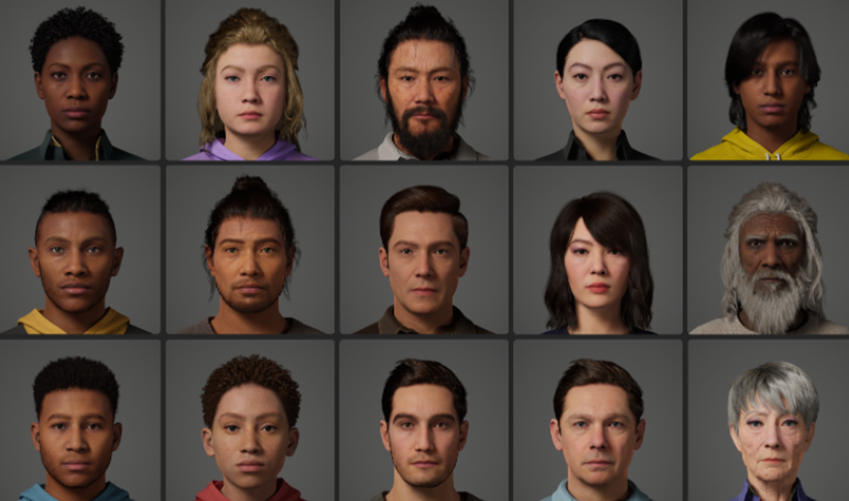

# Digital-Therapeutics-DTx-

- Period : 2022.06.20 - 2023.02.28
- CTO : 김동준
- Member : 김종훈, 최은영
- Subject : 가상현실 기반 디지털 치료제
  
## 목표

본 프로젝트는 다수의 사람이 모이는 장소에서의 공포증에 대한 노출 치료를 위해 몰입형 기기에서 동작하는 Virtual Reality agoraphobia Exposure Therapy (VRET) 어플리케이션을 개발하는 것을 목표로 한다. 크게 세 가지 요인에 대해 가상공간과 가상노출 환경을 구성한다: 1. 장소요인-대형마트(대형공간과 군중), 지하철(운송수단), 엘리베이터(밀폐공간), 2. 사람요인-사람의 많고 적음 및 특정인 노출, 3. 안전요인-출입구로부터의 거리, 지하/지상/고층. 사용자는 이러한 세 가지 요인을 개별 설정할 수 있으며, 이로부터 노출 치료를 진행할 가상 환경을 직접 구축하는 사용자 맞춤형 서비스를 제공한다. 또한, 다양한 생체/위치 센서 데이터를 활용하여 사용자와 노출 환경에 대한 상호작용에 대한 몰입도를 높여 노출 치료의 효과를 높인다.

## 개발 내용

본 과제는 몰입형기기(Head Mounted Device, HMD)에서 동작하는 디지털 노출치료 어플리케이션을 구현한다. 몰입형기기는 Oculus Quest2를 기본으로 하며, 노출치료 어플리케이션은 Oculus Quest2에서 Stand-alone 으로 동작할 수 있도록 안드로이드용 패키지로 제공된다. SMD 솔루션의 위치 및 생체 센서데이터를 블루투스기반의 무선 인터페이스를 통해 제공받으며, 사용자와 노출 환경에 대한 상호작용에 활용한다. 기본적으로 어플리케이션에 해당 데이터를 어플리케이션에 표시하고, 이를 몰입형기기에 연결된 모바일폰에도 동작하는 앱(SMD 솔루션 제작)에 전달한다. 추후, 해당 데이터의 분석을 통해 지능형 노출 환경 자동 설정 및 어플리케이션 사용자 경험 향상에 활용하도록 한다 (이 내용은 추후 SMD 솔루션과 협의 후 진행). 
개발 툴은 Epic Games 의 Unreal Engine 5 를 사용하며 Python 또는 C++ 모듈 코드가 모두 포함된다. Epic Games 에서 제공하는 유/무료 Assets 을 활용하여 가상현실을 구성하고 사실적 아바타 모델에 대한 상호작용을 애니메이션으로 사용자에게 보인다. 실사화 아바타모델 구성 시 메타휴먼 리소스를 활용하며, PCVR 버전과 모바일 버전 각각에서 동작할 수 있는 최대의 품질을 별도 제공한다. 

본 과제의 노출치료의 범위는 다수의 사람이 모이는 장소에서의 공포증으로 정하고, 다음의 세 가지 요인을 사용자가 설정할 수 있도록 하여 사용자 맟춤형 노출치료 서비스를 가능하도록 제공한다. 

1. 공간요인: 광장공포증을 경험할 수 있는 장소
· 대중교통(지하철)
· 대형마트
2. 사람요인: 3.3㎡(1평) 당 인원
· 0명 - 사용자 본인을 제외하고 아무도 없는 환경
· 7명 – 최대 밀집도
3. 안전요인: 공간 구조 및 위치
· 출입구로부터의 거리
· 지하/지상/공중

