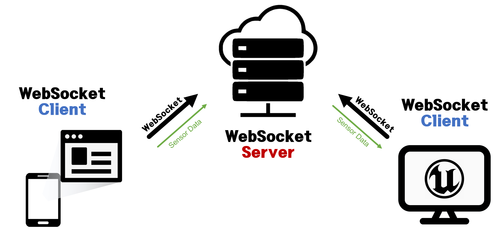

# Digital-Therapeutics-DTx-

- Period : 2022.06.20 - 2023.02.28
- CTO : 김동준
- Member : 김종훈, 최은영
- Subject : 가상현실 기반 디지털 치료제
  
## Goals

본 프로젝트는 다수의 사람이 모이는 장소에서의 공포증에 대한 노출 치료를 위해 몰입형 기기에서 동작하는 Virtual Reality agoraphobia Exposure Therapy (VRET) 어플리케이션을 개발하는 것을 목표로 한다. 

## Project Stack

- Device : Oculus Quest2, Miband7
- Tool : Unreal Engine 5.0
- Stack :   

## Challenging problems
1. Metahuman을 환경에 다량 배치하기 위한 최적화 
2. Oculus에서 고해상도의 환경을 플레이하기 위한 최적화
3. Miband와 Oculus와의 데이터 통신
4. 동양적인 외모의 메타휴먼 생성

## Establishing a Websocket connection with WebView

- 목표 : Miband로부터 데이터를 수신받아 Unreal engine으로 전송하는 것
  
**WebSocket**을 통해 **WebView**와 **Unreal Engine** 간의 데이터 **통신**을 가능하도록 한다. WebSocket이란 하나의 TCP 접속에 **전이중 통신 채널**을 제공하는 컴퓨터 통신 프로토콜로 클라이언트와 서버, 즉 **브라우저와 서버**를 연결하고 실시간으로 통신이 가능하도록 할 때 사용되는 일종의 `소켓`이다. 서버는 node.js 기반으로 작성된 예제 코드를 사용하였으며, Unreal Engine은 버전 5를 사용하였다. 위 이미지는 해당 통신 과정을 간략하게 설명하고 있다. 

## References

- WebSocket server using the ws module :  https://github.com/chris-gong/ws-server-example-nodejs

- [JavaScript] WebSocket echo 클라이언트/서버 예제 : https://m.blog.naver.com/PostView.naver?isHttpsRedirect=true&blogId=websearch&logNo=221136808820

- How to Use WebSockets in Unreal Engine : https://www.youtube.com/watch?v=l9TTmtDBTWY

- Korea Subway 3D model : https://www.cgtrader.com/3d-models/vehicle/train/korea-subway-seoul-line1